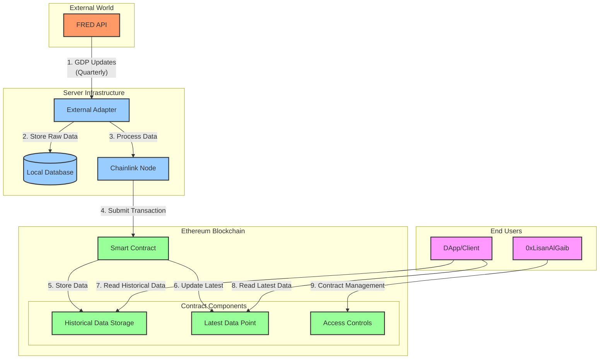

```mermaid
flowchart TD
    subgraph External["External World"]
        FRED["FRED API"]
    end

    subgraph Server["Server Infrastructure"]
        EA["External Adapter"]
        DB[(Local Database)]
        CN["Chainlink Node"]
    end

    subgraph Blockchain["Ethereum Blockchain"]
        SC["Smart Contract"]
        subgraph Contract["Contract Components"]
            HD["Historical Data Storage"]
            LD["Latest Data Point"]
            AC["Access Controls"]
        end
    end

    subgraph Users["End Users"]
        DApp["DApp/Client"]
        CON["0xLisanAlGaib"]
    end

    %% Data Flow
    FRED -->|"1. GDP Updates\n(Quarterly)"| EA
    EA -->|"2. Store Raw Data"| DB
    EA -->|"3. Process Data"| CN
    CN -->|"4. Submit Transaction"| SC
    SC -->|"5. Store Data"| HD
    SC -->|"6. Update Latest"| LD
    
    %% User Interactions
    DApp -->|"7. Read Historical Data"| HD
    DApp -->|"8. Read Latest Data"| LD
    CON -->|"9. Contract Management"| AC
    
    %% Styling
    classDef external fill:#f96,stroke:#333,stroke-width:2px
    classDef server fill:#9cf,stroke:#333,stroke-width:2px
    classDef blockchain fill:#9f9,stroke:#333,stroke-width:2px
    classDef users fill:#f9f,stroke:#333,stroke-width:2px
    
    class FRED external
    class EA,DB,CN server
    class SC,HD,LD,AC blockchain
    class DApp,CON users
``` 